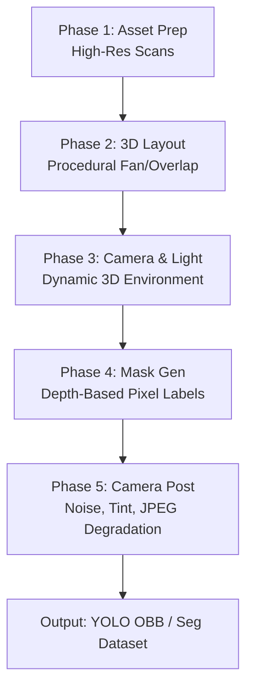

# 3D Scene Banknote Composition Pipeline

## Goal
To build a programmatic, highly parameterized **3D banknote composition engine** that generates infinite, photorealistic, and automatically labeled datasets. The pipeline's core focus is solving complex visual tasks—specifically **highly overlapped banknotes, chaotic fan arrangements, and perspective-warped partial views**—which are notoriously difficult to label manually or capture in real life.

---

## Core Philosophy & Main Ideas

1. **Scans as Perfect Textures**: 
   High-resolution scans of banknotes (front and back, such as the ultra-high-resolution Numista scans) are treated as pixel-perfect diffuse textures. We map these textures onto simple, mathematically controllable 3D paper models.
2. **Programmatic & Sandbox-Friendly**:
   The generator must run programmatically from code (no manual UI interaction in Blender). This allows the agent to execute, verify, scale, and adjust the generator entirely within the system sandbox.
3. **True 3D Spatial Geometry**:
   Instead of flat 2D layering, notes are arranged in a 3D coordinate space. This enables realistic physical interactions: notes curving over each other, casting soft depth shadows, tilting under camera perspectives, and bending under gravity or finger grips.
4. **Infinite Physical and Optical Variations**:
   - **Physics & Layouts**: Overlapping, fanning, piling, folds, creases, and crumpling.
   - **Optics & Sensors**: Infinite camera heights, angles (yaw/pitch/roll), lens focal lengths, depth-of-field, sensor grain, lens flare, temperature/tint shifts, and JPEG compression.
   - **Lighting**: Dynamic color temperatures, directional spot lighting (mimicking home/shop bulb styles), and 360° environmental HDRIs.
5. **Flawless Multi-Task Labels**:
   Because the engine knows the exact 3D coordinates, meshes, and depth-buffers of every banknote, it can compute pixel-perfect **2D Bounding Boxes**, **Rotated Bounding Boxes (OBB)**, and **Instance Segmentation Masks** of only the *visible* portions of each note—instantly resolving the complex occlusion problems of banknote fans.

---

## Technology Stack Evaluation

To implement this programmatic pipeline within the agent sandbox, we evaluate three major approaches based on speed, quality, and sandboxed execution:

| Criteria | Option A: Headless Three.js (Node.js + Puppeteer) | Option B: Blender Python API (`bpy` headless) | Option C: Pyrender / Trimesh (Pure Python) |
| :--- | :--- | :--- | :--- |
| **Rendering Quality** | High (WebGL, Custom Shaders, PBR) | Extreme (Cycles Path Tracing / Eevee) | Moderate (OpenGL Rasterization) |
| **Speed** | Very Fast (GPU-accelerated, parallelizable) | Slow (Path-tracing is heavy, Eevee is faster) | Fast (OpenGL-based) |
| **Physics/Deformation**| Custom vertex shaders or simple mass-spring | Built-in Cloth & Soft-Body Physics | Manual mathematical grid deformation |
| **Dependencies** | Node.js, `puppeteer` or `gl` | Huge Blender binary installation | Python packages (`pyrender`, `pyopengl`) |
| **Sandbox Feasibility**| **Excellent** (Uses pnpm/npm, headless rendering) | **Difficult** (Disk space and binary constraints) | **Good** (Can hit OpenGL headless issues on Windows) |

> [!NOTE]  
> This is the original 3D pipeline proposal. The current decision memo in `docs/synthetic-strategy-evaluation.md` is more conservative: keep the renderer-agnostic 2.5D harness as the main path, and promote WebGL/3D only after a small Windows-stable proof produces exact ID masks and beats matched 2.5D data on reviewed real partial-note benchmarks.

---

## The 5-Phase Pipeline Architecture

### Phase 1: Asset Preparation & Texturing
- **Inputs**: High-res orthophotos (front/back) of KHR and USD banknotes.
- **Decomposition**: Apply background removal (e.g., PicWish or local segmenter) to isolate the bill shape perfectly.
- **PBR Texture Maps**:
  - **Diffuse Map**: The original high-resolution banknote image.
  - **Bump/Normal Map**: Generated from luminance to simulate paper fiber texture, engraved security patterns, and folds.
  - **Roughness Map**: Low roughness for crisp pristine paper; higher, uneven roughness for worn/circulated notes.
- **Mesh Setup**: A flat 3D plane subdivided into a grid (e.g., $32 \times 32$ vertices) to allow for procedural bending, crumpling, and edge curling.

### Phase 2: Procedural 3D Layout & Physics
Instead of placing notes randomly, scenes are generated according to realistic mathematical rules:
1. **The Radial Fan**: Notes share an anchor point (mimicking a thumb/hand grip) and are spread across a small angle sweep ($\theta_{start}$ to $\theta_{end}$). Vertices are perturbed to simulate notes resting on top of each other.
2. **Dense Overlap Stack**: Notes are stacked sequentially with random small $X, Y$ offsets and slight rotations, using incremental $Z$-elevations to avoid Z-fighting.
3. **Crumple & Curl Deformations**:
   - **Global Curvature**: Apply a quadratic bend formula along the note's major axis to simulate the natural curl of paper.
   - **Local Creases**: Add low-frequency Perlin noise to the vertex displacement mapping to represent worn, crumpled bills.

### Phase 3: Camera, Lighting, and Environments
- **Lighting Rig**:
  - **Ambient Light**: Soft fill-light to simulate ambient room bounce.
  - **Point/Spot Lights**: Cast sharp, directional shadows with adjustable hardness/softness.
  - **Shadow Mapping**: High-resolution shadow maps to generate contact shadows where notes overlap, a crucial depth cue for computer vision.
- **Camera Rig**:
  - **Perspective & Angle**: Place the camera on a hemisphere dome above the table. Randomize tilt (pitch, roll) to mimic handheld phone camera angles.
  - **Field of View (FOV)**: Randomize between $35\text{mm}$ (portrait/narrow) and $24\text{mm}$ (wide-angle/distorted).
- **Backgrounds**: Project real-world textures (wood grain, plastic shop counters, concrete, wallets) onto a ground plane underneath the banknote meshes.

### Phase 4: Flawless Pixel-Perfect Labeling
To solve the hardest problem in banknote CV—identifying which note is which in a crowded fan—we render the scene in two passes:
1. **Visual Pass**: Renders the photorealistic scene with lighting, textures, shadows, and background.
2. **ID / Label Pass**:
   - Textures and lighting are disabled.
   - Each banknote instance is rendered with a unique, solid emission color (e.g., Note 1 is `#FF0000`, Note 2 is `#00FF00`).
   - Ground truth labels are extracted directly from the resulting flat color buffer:
     - **Segmentation Mask**: The exact pixel footprint of each solid color.
     - **Visible Bounding Box (Bbox)**: The axis-aligned bounding box of the visible pixel pixels.
     - **Rotated Bounding Box (OBB)**: The minimum-area rectangle enclosing the visible pixels.
     - **Occlusion Thresholding**: Automatically flag or discard notes that are $>85\%$ occluded, preventing the model from trying to guess notes with zero visible context.

### Phase 5: Optical Post-Processing
To bridge the gap between clean 3D renders and raw phone camera shots (the **domain gap**), apply these post-processing filters to the final canvas before export:
- **Lens Effects**: Subtle chromatic aberration, vignette, and depth-of-field blur.
- **Color Grading**: Randomize color temperature (warm shop bulbs vs. cold daylight) and tint.
- **Sensor Degradation**: Add Gaussian sensor noise, ISO grain, and mild sharpening.
- **Compression**: Save with random JPEG quality settings ($60\% - 95\%$) to emulate compression artifacts from messaging apps or budget mobile browsers.

---

## Implementation Roadmap

- [ ] **Milestone 1: Proof-of-Concept WebGL Renderer**
  - Set up a headless Node.js runner with Three.js and a minimal custom WebGL rendering environment.
  - Render a single high-res banknote texture on a 3D grid with controllable curl.
- [ ] **Milestone 2: Multi-Pass Label Generator**
  - Implement the two-pass rendering pipeline: color texture visual pass + flat ID pass.
  - Extract and save 2D bounding boxes and pixel-accurate binary masks.
- [ ] **Milestone 3: Procedural Fans and Stacks**
  - Write algebraic generators for tight radial fanning, overlapping, and hand-held grids.
  - Implement contact shadow mapping between layers.
- [ ] **Milestone 4: Optical Post-Processors & Exporters**
  - Set up shader-based post-processing (grain, temperature, vignette).
  - Add exporters for YOLO-Detect (xywh), YOLO-OBB (rotated boxes), and COCO segmentation masks.
- [ ] **Milestone 5: Close the Loop (Train & Validate)**
  - Generate a curriculum-based synthetic dataset (1k to 10k scenes).
  - Train YOLO26n OBB and evaluate accuracy against the real-world Khmer banknote fan benchmark.
